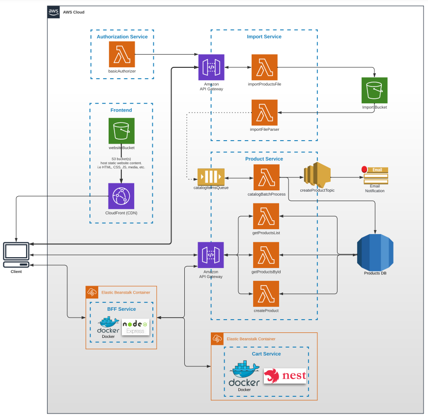

# aws-serverless-ecommerce

The repository stores implementation code of the following architecture:

### Toolset:
* AWS SDK 2/3
* Serverless framework

### AWS Services
* Lambda, Authorizer
* S3
* Dynamodb
* SQS
* SNS
* Elastic Beanstalk

### Architecture

